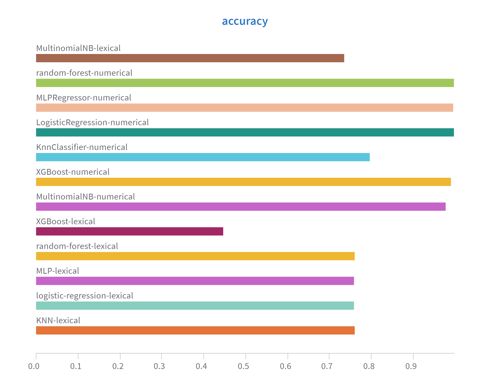
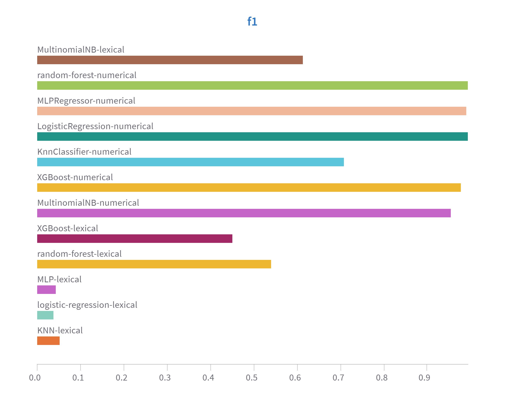
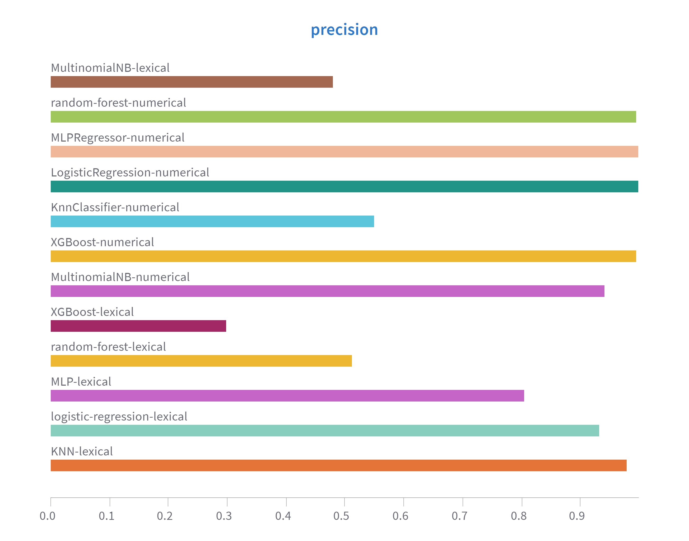
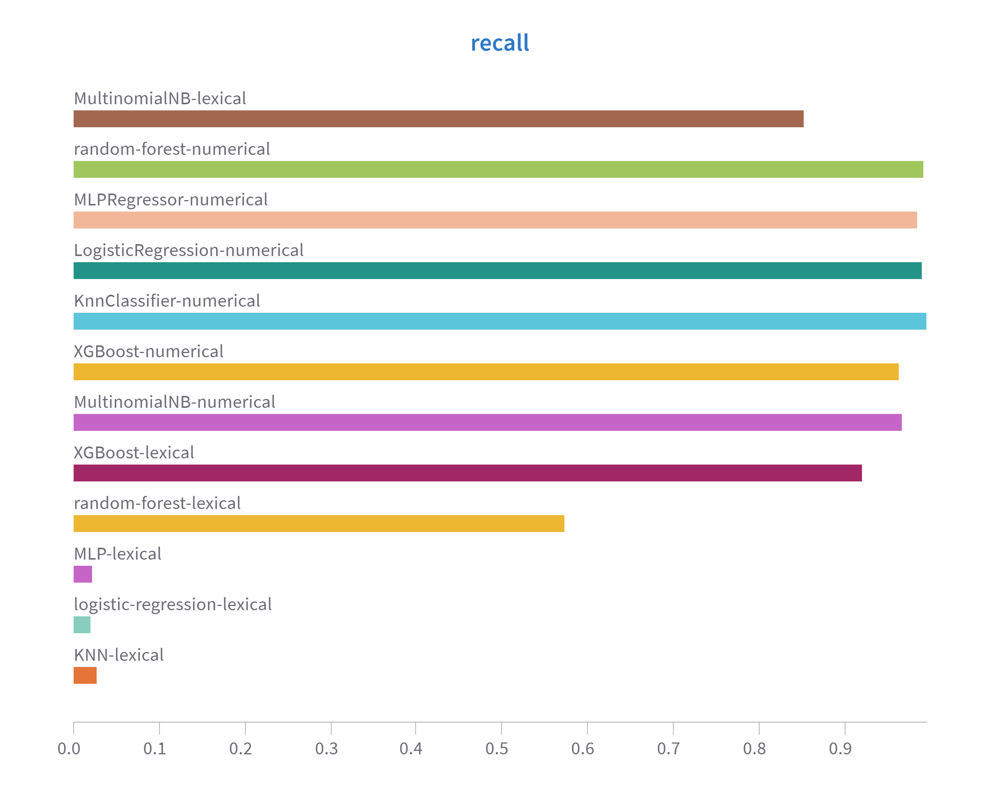

# Malware URLs Detection

### Overview

Classifier that is able to discriminate among benign and malware URLs. The input format, requirements and suggestions are discussed, in more detail, below.

### Labels

The labels are the URL types, benign and phishing. See in the table below. 

| Label | Description  |
|-------|--------------|
| 0     | Benign URL |
| 1     | Malware URL |

### Dataset partition

The dataset to be used for this problem follows (approximately) a 80/10/10 split rule:

• Train: 37,555 samples

• Test: 4,694 samples

For the training and validation subsets, is providing a csv file containing 2 columns: url and label.

# Approaches:
- [x] _Lexical_
- [x] _numerical - token counts_

## _The lexical approach_:

### Features

**scheme://netloc/path;parameters?query#fragment =**

The URL can be separated into hostname, path and parameter components. Within each section we further tokenized strings using the delimiters specified  ‘/’ , ‘?’ , ‘.’ , ‘=’, ‘-’, ‘_’. 

### 1.Lengths

- hostname - the entire hostname, including the delimiting dots, has a maximum of 253 ASCII characters: ASCII(7) letters from a to z, the digits from 0 to 9, and the hyphen (-)
- first-directory URL
- path
- parameters
- top-level-domain
- second-level-domain

### 2.Counts
- delimiters,‘-’, ‘@’, ‘?’, ‘.’, ‘=’, ‘%’, ‘http’, ‘www’,
- digits in hostname
- numbers 
- letters
- tokens
- non-alpha numeric
- directories

### 3.Pattern
- case changes
- most consecutive occurrences of a character
- most frequent token
- similarity to blacklist words
- blacklist word count

### 4.Binaries
- ‘.com’ out of place
- IP address for a hostname
- similarity to alexa-top-10 domains
- the presence of an alexa-top-10 domain out of place

### 5.Ratios
Calculate the ratio between different types of characters or tokens.
- vowel / consonant ratio
- digit / letter ratio
- average length tokens for each subsection and the entire URL

## _The numerical approach_:

Using CountVectorizer to extract the features from URLs

# Results

